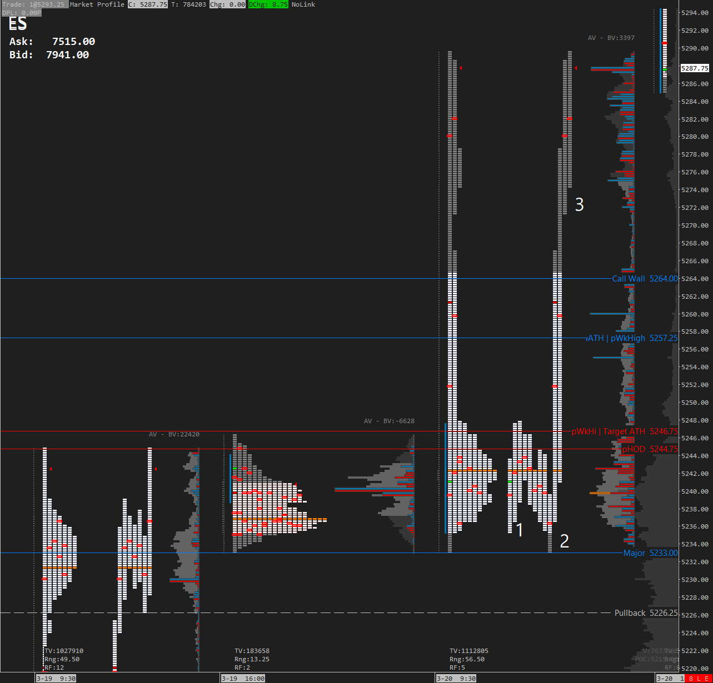
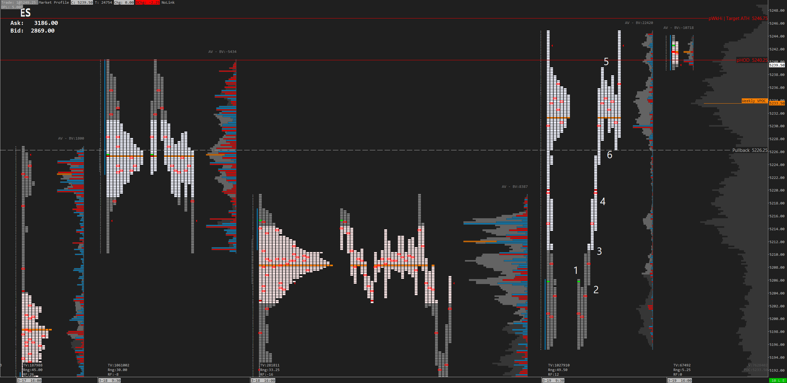

[Mar 20 2024](#March-20-2024)  
[Mar 19 2024](#March-19-2024)

# March 20 2024 - FOMC

1. B period low against A's low. Also C periods low one timeframing. This isn't a setup every day but after the move up yesterday it makes sense. 
2. Look below the IBL and fail, also ONL. 
3. The volatility makes this more difficult but we should expect volatility on strong moves. K period can't fill the singles. Where to put your stop on this one is more difficult but with the volatility I like scalpier entries and exits anyway. M period also gave you another entry although I don't like it as much. 

**Key Points**
- I didn't watch the session today. I was up all night working on code so I didn't pay attention. 
- Today was FOMC day. The number came out as expected.  

---

# March 19 2024

1. Break of B period inside bar.  
2. Pullback to A high | Open | B High after IBH break.  
3. Pullback to fill D singles.  
4. Fade the Overnight High
5. Fade Monday's HOD
6. Close G singles | Monday POC

## Day Summary

**Key Points**
- We gapped down after gapping up yesterday (although in balance).  
- We put in a tight IB and looked like we would get a trend day up. The problem is that we have FOMC tomorrow and my bias led me to believe that it was improbable to get a trend day before FOMC (at least when I don't suspect a change in the narrative).  

