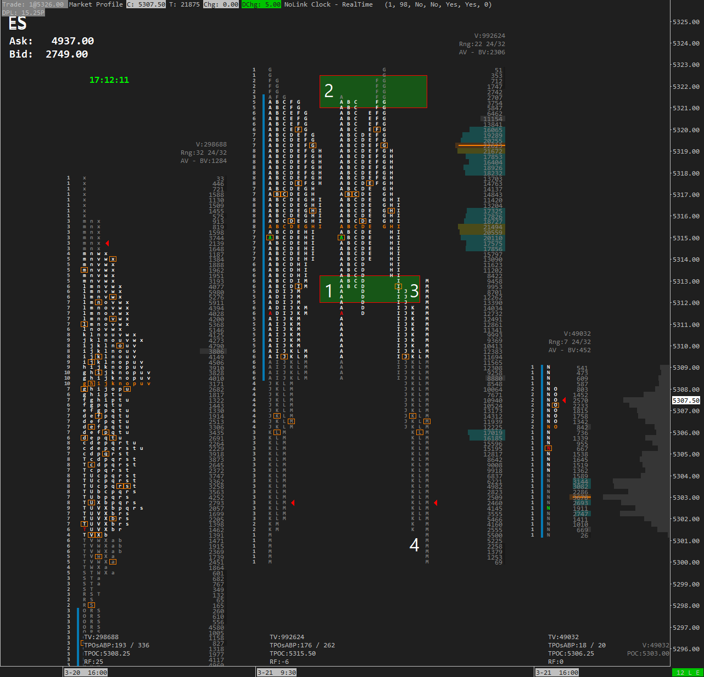

# Table of Contents

[Friday March 22](#2024-03-22)  
[Thursday March 21](#2024-03-21)  
[Wednesday March 20 FOMC](#2024-03-20)  
[Tuesday March 19](#2024-03-19)  
[Monday March 18](#2024-03-18)  

# 2024-03-22

text

## Previous Day Review

Following a strong overnight session, ES opened with a 25 point gap building on momentum from yesterdays trend day. Despite multiple attempts to establish new highs, we observed poor highs in B and C period, with periods D and E falling just short of qualifying as poor highs. 

We made new highs in F period but we could only manage 3 ticks before a pullback. Again in G period we could only auction 2 ticks above F's high before auctioning lower. 

In periods H, I, J, and K, we witnessed an inventory correction and one-timeframed down. M period stopped the one timeframing down before continuing lower and closing near the lows.

**Key Points**
- Light volume at 990k and small range of 22.75 points.  
- Higher value. 

>**Session Stats**  
>Volume: 990k  
>Range: 22.75 points  
>Rotational Factor: -6  
>Delta: +2600  

## Overnight Review (_updated at 0700 CT_)

Text

>**Session Stats**  
>Volume: 
>Range:  
>Rotational Factor: 
>Delta: 
>Positioning:   

## Mission Plan

Text

#### References I am watching today (high to low)

`5000` 

>**Notable Earnings**  
>No notable earnings

>**Important Economic Releases** (_central time_)  
>0700: Jerome Powell  
>0800: Philip Jefferson  
>1015: Michael Barr  
>1400: Raphael Bostic  

#### Other Markets

# Notes from the session

0823: The market appears too long. We have a poor high in Globex and the last 3 periods before the open are poor as well. 

# Setups

1. 

# HTF Gex setups

# AfterMarket Report - Thursday March 21 2024

### Market Overview

Text

### Previous Day Review

Text.

### Analysis

Text

### Strategy Going Forward

Text

------------------------------------------------

# 2024-03-21

After a bullish reaction to FOMC we are continuing into uncharted territory. We will monitor for acceptance at higher prices and continuation of the current trend.

## Previous Day Review

A sideways overnight market and an open inside the overnight and previous range indicated a weak open ahead of FOMC. We continued to trade sideways until the announcement as buyers lifted the market to record highs. After the break from balance we pulled back inside the range before extending the range yet higher, closing near the highs and leaving unfilled singles below. 

Although the move higher was bullish the structure was weak and the volume light. 

- Key Points  
- Light volume of 1.1 mln casts doubt on the move higher. Only +3k positive delta.  
- Weak structure below settlement.  

>**Session Stats**  
>Volume: 1.1 mln  
>Range: 56.50 points  
>Rotational Factor: +5  
>Delta: +3300  

## Overnight Review (_updated at 0700 CT_)

The Globex session opened up and extended yesterday's rally to new highs leaving a poor high at `5316`. The Euro session opened with a pullback and is now rotating back up to test the ETH High. 

Volume and range are strong indicating increased activity in the overnight session. If we do not get any meaningful correction before the open the move up could be a liability in the RTH session. Inventory is 100% long without any meaningful structure to lean on for support. 

>**Session Stats**  
>Volume:  250k  
>Range:  30.50 pts  
>Rotational Factor: 20  
>Delta: +2600  
>Positioning:  100% Long  

## Mission Plan

After a large release or event we may get a change in the perception of value in the market. The mission today is to see if see if higher prices are accepted and monitor for continuation. So how do we do that?

- What is the volume like? Are we seeing strong volume on moves up?  
- How is value forming? It appears that we will have a gap up when we open in 90 minutes. Is value moving lower towards yesterdays range? Is there no apparent value forming? Is the POC moving lower/looking like it will move lower?
- What is tempo like? Are we seeing strong tempo on moves up or down?  
- Do we have excess at the highs or lows? We currently have a poor high in ETH, is the market too long to move higher?

These are the things that I will be monitoring for today. The structure from the FOMC reaction yesterday is weak. I will also watch for the Bid/Ask and see where the buyers and sellers are stepping in. 

- Are the buyers and sellers front running key references like pHOD?  
- Are the reactions and tempo poor at references?

#### References I am watching today (high to low)

`5316` current ETH high | HTF Call Wall | poor high (is the market too long?)  
`5290` pHOD  
`5171` Top of the only set of singles yesterday | 1σ↓ | Major Gamma `5263`  
`5245-50` Prev. Weekly High | Top of Balance | FOMC Breakout | 2σ↓  
`5233` pLOD | Weekly VWAP | Over/ Under
`5225` Tuesday Pullback Low and Singles | Previous Structure   
`5200-10` Monthly Vwap | Tuesday LOD (poorish low)  
`5183` Confluence Zone

>**Noteable Earnings**  
>AM: Walgreens (WBA) 

>**Important Economic Releases**  
>0730: US Philly Fed Business Index  
>0730: US Initial Jobles Claims  
>0845: US S&P PMI Flash  
>1100: Fed Barr (voter)  
>1200: US 10-yr TIPS Auction (16bln)

#### Other Markets

# Notes from the session

0823: The market appears too long. We have a poor high in Globex and the last 3 periods before the open are poor as well. 

1122: We have the IB stat. Because of the lower volume and the market being long I am looking for opportunities to catch an inventory correction. 

Tempo is much better on selling. 

We are seeing large buyers come in on pullbacks. Sellers at the highs. 

1200: The market is trying to go higher but not doing a great job with several poor highs. 

# Setups

1. B period could have been bought although there wasn't much to lean on except the current trend and not being able to fill the gap. I do believe C and D lows were good buys against B's low and A's excess. 
2. This is more difficult given the current trend but given the market was pretty long it makes sense in that regard. A, B, C, D, E, F and G's highs are all within a few ticks of each other. 
3. I like the break below G and H period but we also had pullbacks in J and K period that were worth selling. 

# HTF Gex setups

- SPY  
- QQQ  
- MSFT  
- TSLA  
- GOOGL  
- AMZN  
- AVGO

# AfterMarket Report - Thursday March 21 2024

### Market Overview

The uptrend remains robust across all timeframes as we witness a gap opening above yesterday's trend day. 

### Previous Day Review

Following a strong overnight session, ES opened with a 25 point gap building on momentum from yesterdays trend day. Despite multiple attempts to establish new highs, we observed poor highs in B and C period, with periods D and E falling just short of qualifying as poor highs. 

We made new highs in F period but we could only manage 3 ticks before a pullback. Again in G period we could only auction 2 ticks above F's high before auctioning lower. 

In periods H, I, J, and K, we witnessed an inventory correction and one-timeframed down. M period stopped the one timeframing down before continuing lower and closing near the lows.

### Analysis

Despite afternoon weakness, the market held its ground and refrained from filling the downside gap, indicating resilience in the upward bias. It appears that the market was too long and we could not find enough buyers to continue the rally higher. This was first evidenced by the poor highs in B, and C period. 

The volume was light today with only 990k contracts traded in RTH. Market participants were balanced with a net delta of +2300 contracts. Range was only 22 points on the day. 

### Strategy Going Forward

Looking ahead, the focus shifts to monitoring for acceptance at higher prices as the market seeks to establish a new equilibrium. We are still in an uptrend on all timeframes and today we gapped up and had higher value despite weakness in the afternoon. This morning I talked about the possible change in perception of value in the market and the need to watch for acceptance at higher prices. The market is currently out of balance and seeking a fair price at which we can do business, it's crucial to observe for signs of genuine acceptance at elevated price levels. Given the light volume and the market's current out-of-balance state, it doesn't appear that the market is interested in trading at these prices.

With tomorrow's light news day, staying vigilant and adapting to changing market perceptions will be key to navigating potential shifts in value. I will share my write up and levels on substack in the morning. You can find the link in the comments below. If you subscribe you will get an email notification when it is published. 

Lets take a look at the GEX levels. 

------------------------------------------------

# 2024-03-20

Text 

## Previous Day Review

Tuesday was a good example of how the price action inside of balance can be hard to forecast with high probability. After a large gap up on Monday we had a large move of -29 points in the overnight that ended with a 10 point gap at the open. The majority of the move was late in the Euro session. 

I wrote in my premarket note that when the market stops making sense (to me) I get more cautious. I also said that I will look for continuation down but I want to see clear MGI showing the probabilities for continuation down are strong. 

We opened and immediately saw weakness off the open but couldn't get much follow through selling. B period then put in an inside bar leaving a small IB of only 11 points. The MGI was stacking to the downside at this point. We couldn't auction above the open and we had a considerable gap to the downside. 

I like to watch for a break of B period when its an inside bar. C broke B's high, the IBH, and closed the gap leaving a weak high at Monday's low `5210.25` which was the first level on our price map. Weak highs are very visual levels so we should expect those to be taken. At this point the MGI is indicating we should get more upside. 

D period pulled back to the IBH and Open and found buyers ahead of C's halfback. We then put in our first set of singles in D period. We put in 3 more sets of singles in the day that all remain unfilled. We briefly paused at `5225` which was also on our price map before continuing higher. `5225` also served as our afternoon pulback and the low of the upper distribution. 

We eventually balanced below Monday's HOD and our Supply Zone `5240-46` for 5 periods before putting in an exploratory price spike and moving value up to this upper distribution. The price spike fell 10 ticks shy of all-time highs and ended the day closing inside the spike and above Monday's HOD. 

**Key Points**

- Monday's and Tuesday's gaps were filled.  
- 4 sets of unfilled singles.  
- Closed 10 ticks from all-time highs.  

I am surprised that we put in so many singles on the eve of FOMC even though the market clearly gave us indications that this would happen. I allowed my bias of historically seeing small ranges prior to FOMC to affect my ability to think in terms of probabilities. 

>**Session Stats**  
>Volume: 1.0 mln  
>Range: 49.50 points  
>Rotational Factor: +12  
>Delta: +22k  

## Overnight Review (_updated at 0900 CT_)

Text

>**Session Stats**  
>Volume:  
>Range:  
>Rotational Factor:   
>Delta:  
>Positioning: 

## Mission Plan

Text

#### Open above | Scenario 1

Text 

#### Open Below | Scenario 2

Text 

>**Noteable Earnings**  
>No noteable earnings  

>**Important Economic Releases**  
>No noteable Economic Releases today

#### Other Markets

# Notes from the session

---

# 2024-03-19

Indexes are trading modestly lower ahead of tomorrows FOMC announcement. 

## Previous Day Review

After a strong move up late in the overnight session ES opened with a true gap of 23 points. We saw the `5222` level from the price map hold as support and the IBL. We rotated higher in A and B period. B period one timeframed up setting the IBH and RTH HOD at `5240.25`, a few ticks shy of the `5241` supply area also in the price map. 

After putting in the IBH (which was unbroken) we one timeframed down in C through F period before taking the IBL in G period. The market mostly balanced the rest of the session until the end of the day when M period put in an exploratory spike lower to 5210.25, the RTH LOD. 

**Key Points**

- Gapped up (held half gap)  
- Took the Overnight High  
- Higher Value  

As always it is important to recognize what we couldn't get done today. The bulls could not breach the `5240-5246` supply area falling short again today. We also couldn't close the gap although we did trade to half gap, leaving a price probe in M period. 

To summarize, the plan this morning provided plenty of context and good areas to watch the auction in order to be aware of what the market might do today. In this mornings note I spoke about how tricky gap days like today can be when we gap higher, build higher value, and also one timeframe lower most of the day. 

>**Session Stats**  
>Volume: 1.0 mln  
>Range: 30 points  
>Rotational Factor: -8  
>Delta: -5500  

## Overnight Review (_updated at 0900 CT_)

ES traded lower through the Asian session. Early in the Euro session we auctioned above the Asia HOD and pSettle. This quick move was met with sellers as the market sold off to new lows. We are currently building a double distribution inside Friday's range down 21 points in the Overnight.

>**Session Stats**  
>Volume: 240k  
>Range: 33 pts  
>Rotational Factor: -18  
>Delta: +3k  
>Positioning: 100% short  

## Mission Plan

We have obvious weakness in the overnight session as we gap down below the previous gap that was unfilled. When the market stops making sense I get more cautious. I will be looking for continuation of the move down but I will need to see market generated information clearly in favor of continuation down. 

I am aware that we have FOMC tomorrow so there will likely be less range than yesterday so the opportunies may be less as well. 

#### Open above 5183

I will look for support around `5183` which is an area of confluence. I do not expect much upside

`5183` is an area of confluence with Fridays (and the previous weekly) settle, Friday's TPOC, and structure. I will look for this to act as support. 
`5201` Friday's HOD. Above here I will look for the gap to fill and target previous LOD at `5210`. 
`5225` Previous POC becomes a target. 
`5240-46` is the supply area where we found sellers yesterday. 

#### Open Below or move below 5183

Again I don't expecte a huge move but we have areas to target and we could see strong selling/liquidation. 

`5167` Fridays LOD .
`5157` Is the balance low. This is my ultimate target for the downside. We could potentially see a move lower but the selling would need to be strong. At this level I would expect reversion back into the range. 

>**Noteable Earnings**  
>Before the bell: XPEV, TME, CAL
>After the bell: CRVS, ZTO 

>**Important Economic Releases (_central time_)**  
>1200: 20-yr Auction

# Notes from the session

---

# 2024-03-18

Last week was in inside bar but we maintain the higher timeframe uptrend for now. FOMC is this Wednesday. 

## Previous Day Review

On Friday ES behaved as expected with a rotation balance day that continued the daily one timeframing down from Thursday's session. Here is what the sellers accomplished in Friday's session.

- Gapped lower (true gap).  
- Moved value lower.  
- Acceptance of value lower with a wide TPOC of 11 TPOs slightly below the session halfback.
- Closed below the previous day's low.

Although we made good progress lower there are a couple of things that stand out to me from the session. We had a neutral day profile although the break higher was early in the session and quickly auctioned lower. We were not able to find price acceptance below the Initial Balance low and only left 3 ticks of excess suggesting that perhaps the market was too short or we found a price that buyers were willing to accept. Last but not least, the majority of the move happened in the overnight session. 

We also have to keep in mind that Friday was quad-witching and there were forces at play that will not be in the market come Monday. To summarize, we had a productive move lower with good volume setting us up for further continuation to the downside on Monday.  

>**Session Stats**  
>Volume: 1.4 mln contracts  
>Range: 34 pts  
>Rotational Factor: -1  
>Delta: -16k  

## Overnight Review (_updated at 0900 CT_)

The overnight session moved higher throughout the Asian session to find some resistance at Friday's HOD. Late in the Euro session we saw a squeeze higher that has us currently positioned around 20 points above Friday's range. 

>**Session Stats**  
>Volume: 150k (light)  
>Range: 44 pts (above average)  
>Rotational Factor: 24 (bullish)  
>Delta: +1000  
>Positioning: 100% Long

## Mission Plan

Large gaps can be tricky but my overall bias is to trade in the direction of the gap. My first focus though is to watch for an inventory correction/gap fill early in the session. 

We can have a day where we open higher, build value higher,  and still one timeframe down all day. I will take early attempts at breaking the 30-second Opening Range down. With inventory this long I believe the probabilities are in my favor. 

#### Open above 5201

The game plan here is to look for acceptance above Friday's range. If we fail at any attempts to move lower then I will look for more upside. Slow tempo, small pullbacks in the direction of the gap are worth monitioring for continuation. 

`5201` is Fridays HOD, 1σ↑ and stops the One Timeframing down. I am looking for buyers to step in at this level if we fill the gap.  
`Overnight High | Open` I'm not sure where this will be yet but I will be targeting these levels to take risk off when we get to them. 
`5222` This is the afternoon pullback high and value area high on 3/14 as well as 2σ↑.  
`5241-46` is a supply area with multiple days of excess. 

#### Acceptance back into Friday's range

`5190` is the afternoon pullback high. If we find buyers here I will still look for upside back to Friday's HOD at 5201.  
`5180-82` is TPOC | ONL | pSettle. 
`5167` is Friday's LOD. This isn't a poor low but there isn't much excess either. I will look for buyers/ short covering here at first. Multiple moves to this level will likely fail lower.  

>**Noteable Earnings**  
>No noteable earnings  

>**Important Economic Releases**  
>No noteable Economic Releases today

# Notes from the session

